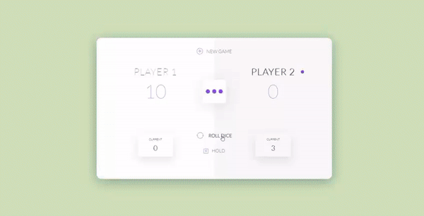

# Dice game

_El juego de los dados_ -
Proyecto desarrollado con javascript para asentar las bases.

## Contenido

- Comenzando
- Instalación
- Estructura

## Comenzando 🚀

_Estas instrucciones te permitirán obtener una copia del proyecto en funcionamiento en tu máquina local para propósitos de desarrollo y pruebas._

_Para guardar este proyecto local:_

[Enlace a la documentación de Github](https://help.github.com/es/github/creating-cloning-and-archiving-repositories/cloning-a-repository).

1. Estas en la página principal del repositorio.
2. Bajo el nombre del repositorio, click *clone* or *download*
3. Para clonar el repositorio usando _HTTPS_, click "clone with HTTP".
4. Abre la terminal y cambia a la ubicación donde deseas que se colne el directorio.
5. Escribe "git clone", y luego pega la URL que copiaste en el paso 2.
```
$ git clone https://github.com/YOUR-USERNAME/YOUR-REPOSITORY
```
6. Presiona Enter (Intro). Se creará tu clon local.
```
$ git clone https://github.com/YOUR-USERNAME/YOUR-REPOSITORY
> Cloning into `Spoon-Knife`...
> remote: Counting objects: 10, done.
> remote: Compressing objects: 100% (8/8), done.
> remove: Total 10 (delta 1), reused 10 (delta 1)
> Unpacking objects: 100% (10/10), done.
```

### Instalación 🔧

Necesitarás instalar 📋 Node.js para trabajar con este repositorio, luego:

1. Descarga o clona el repositorio. ⚙️
```
$ git clone https://github.com/maitevillar/dice-game.git
```
2. Abre el proyecto en tu editor de codigo (Visual Sudio Code, Atom, Brackets...)
3. Instala las dependencias locales
```
$ npm install
```
4. Arranca el proyecto:
```
$ npm start
```

## Imagenes de la web 💻




- Para jugar entra y entretente ! 😀

---
⌨️ con ❤️ por [Maite Villar]